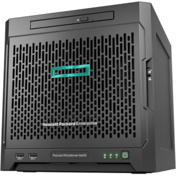
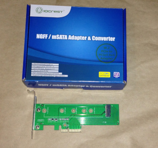
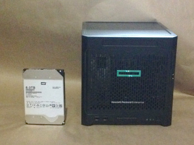
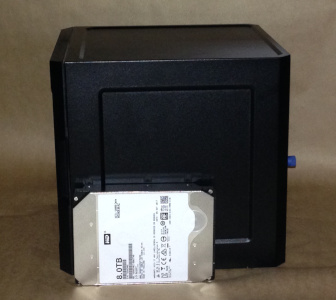
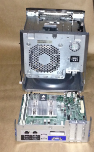
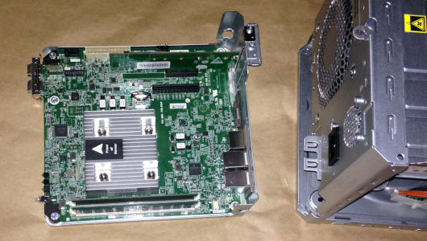
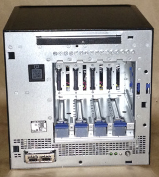
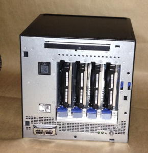

# Hewlett Packard Enterprise ProLiant MicroServer Gen10 build

## Intro

This is not intended to be a professional How-To guide.  Hell, this is
not even intended to be good.  This is simply to document some of the
lessons learned from building out a home server.

## Goals

This was intended to replace a dated home media server that was running out of
space and whose media serving function was replaced with a NVidia Shield
TV.  What I needed now fell under the umbrella of a home NAS (network attached storage).

* Priority features
  * Data integrity
  * Stability
  * Low(er) power consumption
  * Open Source where possible
  * Docker containers to easily try/maintain services.
  * Small physical size
  * Reasonable cost
  * Expandable when needed
  * DVD drive (backing up TV shows for binge watching)

* Less concerned
  * Performance/speed

## The Parts

### Server: Hewlett Packard Enterprise ProLiant MicroServer Gen10

<!-- markdownlint-disable MD033 -->
<table>
  <tr style="border:none;">
    <td style="border:none;">
      <ul>
        <li>1x AMD Opteron X3421</li>
        <li>8GB ECC Ram included</li>
        <li>200w power supply</li>
        <li>2x Gigabit Ethernet</li>
        <li>1x MiniSAS (SATA Backplane 4x SATAIII)
          <ul><li>Hardware RAID levels 0, 1, 10</li></ul>
        </li>
        <li>The model I purchased was configured with no drives.</li>
      </ul>
    </td>
    <td style="border:none;text-align:center">
     
     <div>(Stock photo)</div>
    </td>
  </tr>
</table>
<!-- markdownlint-enable MD033 -->

*SIDE NOTE:* In retrospect, I should have done more research.  When doing this
build I found that a used Gen8 may have been a better fit for me but do not
regret the Gen10.

### Storage: Boot/Operating System

There are a few options

* The Gen10 has an internal USB port to boot from.
* The Gen8 also had a SD card reader.
* Can boot from the RAID drives but this may be complicated depending
  on the configurations.
* The half height bay is can be used for a SSD drive (See NOTE about
  the power connector below)

I went with a lesser known option.  Using a SYBA SI-PEX40110 PCI-e M.2
converter card I am able to boot a 120GB Corsair Force MP300 M.2 2280
PCI-e NVME SSD.




**Important:** A SATA M.2 SDD will not be recognized by the HPE ProLiant
MicroServer Gen10.  This is a lesson I learned the hard and expensive way.  

### Storage: data

Thanks to a tip on [/r/datahorders](https://www.reddit.com/r/DataHoarder/comments/7fx0i0/wd_easystore_8tb_compendium/)
, I waited for a sale on Western Digital (WD) Easystore 8TB at BestBuy
.  Every so often the price would drop to US$149.99 (twice in the Summer
of 2018). After "shucking" the case I had:

* (x4) 8TB white label WD Red 8TB (model number `WDC WD80EMAZ-00WJTA0`)

### Optical drive

Installed a HP 9.5mm SATA DVD-RW JackBlack Gen9 Optical Drive.

**SIDE NOTE:** In retrospect, I should have purchased a faster cheaper
third party DVD drive.  If I did this I would have needed to purchased
a 4-Pin Floppy FDD Male to 15-Pin SATA Female Power Cable (typically
referred to as "Dell MX714").   These are [readily available on eBay](https://www.ebay.com/sch/i.html?_nkw=Dell+MX714)
.  I also would have needed to craft a way to keep the drive
in place as the JackBlack has a small metal bracket.

### Memory

* 1 x 16GB Kingston ValueRAM DDR4 2400 ECM RAM

#### Cost

| |Price ($US)|
| --- | ---: |
| HPE ProLiant MicroServer Gen10 | $420|
| WD EasyDrive 8TB hard drives | $150 (x4)|
| HP DVD-RW | $100|
| 16GB DDR4 2400 ECM RAM | $185|
| M.2 PCI-e To PCI-e 3.0 card | $14 |
| 120GB M.2 NVME | $44 |  
| **Total** | **$1,363**|

## Build

** Reference**:
[HPE Proliant Gen10 microserver hardware and maintenance guide](HPE_Proliant_Gen10_microserver_hardware_and_maintenance_guide.pdf)

I posted the stock photo above because it does not accurately represent
how small this server is.  The 3.5" hard drives are to show scale.




The motherboard slides out allowing the easy installation of the pci-e
card and memory.




The front panel is removed to expose the bays for the RAID hard drives.  Between
the media bay and hard drive bays are a series of screws; these are to be used
on the side of the hard drives to guide them  as they are slid into place.

|||
|---|---|
| Without hard drives: | 
|With hard drives: |

## Operating System

There are many OS's to chose from, this is the list I was choosing from:

* VMWare ESXi - Limited version is free to use (Here is
  [a link on how to download it](https://www.virten.net/2018/05/free-esxi-6-7-how-to-download-and-get-license-keys/))
  and would be a good learning experience as I have not used VMWare in about
  10 years.  However, I prefer open source.
* [Proxmox VE](https://www.proxmox.com/en/) - Debian based install and a
  solid platform for virtualization.  There are has a lot of features I would
  not use like high availability clustering and data replication.  The one item
  I did want, and was not built in, was Docker.  This can be installed on the
  under laying Debian install but then would have little use for the Proxmox
  install after the initial set up.
* [freeNAS](http://www.freenas.org) - This is software typically used in home
  NAS builds; and for good reason, it is amazingly good and full of features to
  make setup and monitoring easy for every skill level.  Even through it
  is FreeBSD based, it does Docker but very limited configuration through
  the interface.  Too limited for my needs.  Damn shame because I really
  liked this.  At the time of writing
  this, there was an issue with booting FreeNas on the Gen10 server but
  [just requires a little tweaking of the kernel parameters at boot.](https://www.virten.net/2017/10/fix-for-freenas-on-hpe-microserver-gen10-x3216-stuck-console-issue/)
* [OpenMedia Vault](http://www.openmediavault.org) - A fork of FreeNAS but with
  Debian as a base.  Instead of trying to have everything built in, features are
  added by installing different plugins.  This sounded perfect but the plugins
  are mostly community written and supported.  This is typically not a bad
  thing but too many were not maintained and buggy.  Additionally
  , some plugins did not play well together and others did not integrate
  well with OMV's interface.
* [Debian](https://www.debian.org) - As many of these choices were Debain based
  and did not find anything that would be useful after the initial set up, I
  went with a vanilla Debian install and added packages as needed.

**Important:** While installing a few of these OS's I had an issue where the
keyboard and mouse would stop working.  It turns out that some bare minimum
installers do not have the drivers or configuration for the USB ports on the
front of the Gen10.  To prevent a lot of headaches for yourself,
just connect a keyboard and mouse to the back USB ports until the install
is complete.

## ZFS

[Reference: Standard RAID levels]([https://en.wikipedia.org/wiki/Standard_RAID_levels)

Data integrity is a priority in this project.  The Gen10 supports [RAID 0](https://en.wikipedia.org/wiki/Standard_RAID_levels#RAID_0)
, [RAID 1](https://en.wikipedia.org/wiki/Standard_RAID_levels#RAID_1) and
[RAID 10](https://en.wikipedia.org/wiki/Nested_RAID_levels#RAID_10_(RAID_1+0)
.  While I would have preferred RAID 6, this would require a battery or
flash backed hardware RAID controller.
Oh well, maybe the next build.  RAID 10 would have met my needs but went with software
based solution, [RAID Z](https://en.wikipedia.org/wiki/ZFS#RAID_(%22RaidZ%22))

RAID-Z level 2 is similar to RAID6 where a drive can fail and be rebuilt
through reslivering.  Soon, it should be able to expand the pool size, live,
by adding extra drives
([link](https://www.freebsdfoundation.org/blog/openzfs-raid-z-online-expansion-project-announcement/)).

It is important to remember that this does not replace the need for backups.  

On Debian, I installed the `zfs-dkms` package to use the ZFS kernel module.  The
following set up relied heavily on the [Arch Wiki as a reference](https://wiki.archlinux.org/index.php/ZFS#Installation)

```bash
# Create a raidz2 zfs pool with mount /mnt/data across the four 8TB drives
zpool create -m /mnt/data data raidz2 ata-WDC_WD80EMAZ-00WJTA0_XXXXXSDA \
                                      ata-WDC_WD80EMAZ-00WJTA0_XXXXXSDB \
                                      ata-WDC_WD80EMAZ-00WJTA0_XXXXXSDC \
                                      ata-WDC_WD80EMAZ-00WJTA0_XXXXXSDD
# disable atime
zfs set atime=off data

# enable compression
zfs set compression=on data

### create volumes

# Volume for docker configurations
zfs create data/docker

# Volume TV shows and movies
zfs create data/media

# Volume for random files I want to keep around
zfs create data/misc

# Volume rsync back up of my laptop capped at 1.5TB
zfs create data/rsync_backup
zfs set quota=1500G data/rsync_backup

```

It is suggested to scrub the pool regularly to prevent "bit rot".  To do
 this, in the root crontab, at the line:  
`30 19 * * 5 zpool scrub data`

## Monitoring

I only need simple monitoring at the moment and chose
[netdata](https://github.com/netdata/netdata).  A live demo is
[available on their website](https://my-netdata.io/).  The Debian package
had a few bugs and removed it to opt for the netdata automatic installer:

`bash <(curl -Ss https://my-netdata.io/kickstart-static64.sh)`

As I do not plan on exposing the server to the internet, binding the dashboard
to `0.0.0.0` is not as big of an issue for me [as it is for others](https://github.com/netdata/netdata/issues/164)

## Docker containers

One of my requirements was using Docker containers.  While there is debate
on where/when and if to use them, they fit my needs perfectly.  If they are
thought of as it they are like self contained applications, it allows me
to spin up a service without
worrying about conflicting packages or conflicting versions of packages, stop
it or remove it if no longer in use, quickly provision using an image from
[Docker hub](https://hub.docker.com/) or extending one to fit my needs.

### Containers used

* [Bitwarden_rs](https://hub.docker.com/r/mprasil/bitwarden) - Store passwords
  in a "Bitwarden-compatible API implementation in Rust".  Much lighter weight
  than the standard bitwarden.
* [Gitea](https://gitea.io/en-us/) - "A painless self-hosted Git service"
  and am using Postgres as a database for better proformance.
* [Nextcloud](https://github.com/nextcloud/docker) - Personal cloud solution
  using Postgres as a database.
  * WebDAV sync for contacts, tasks and calender items.
  * Bookmark backup.
  * Was going to do Phone SMS backup but it does not sync MMS.
* [makemkv](https://github.com/jlesage/docker-makemkv) - Ripping DVDs,
  automatically rips them when a disc is inserted.
* [handbrake](https://www.okcupid.com/profile/Laz40?cf=regular,matchsearch) -
  Encode and compress ripped files.  Watches output of makemkv to automatically
  encode newly created files.
* [filebot](https://github.com/jlesage/docker-filebot) - Rename encoded files
  to be matched by [Kodi](https://kodi.tv/)
